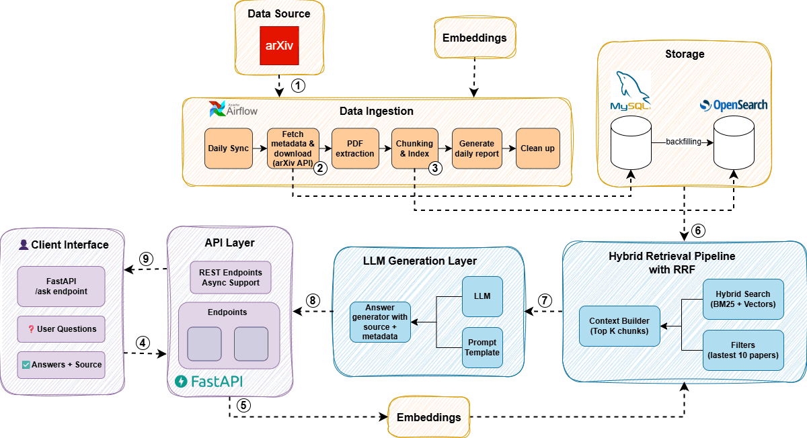
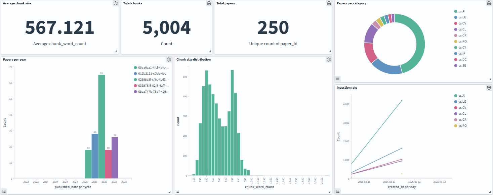

# Research Paper Curator

<div align="center">

<h3>
Scientific Papers • Data Ingestion • Semantic Search • RAG
</h3>

<p>
A modular system for collecting, processing, and querying scientific literature using LLMs.
</p>

<p>

<p align="center">
  
  
  
  
  
  <a href="https://github.com/tamchamchi/research-paper-curator/blob/main/LICENSE">
    
  </a>
</p>
</p>

</div>

<p align="center">
</p>

---

## 📖Overview 

Research Paper Curator is a modular system designed to ingest, process, and query scientific literature. The system provides:

- **Automated daily ingestion pipeline** that periodically fetches research papers from the arXiv API, downloads PDFs, and processes documents into structured data.

- **Scalable document processing** that parses scientific papers and prepares content for downstream indexing and retrieval.

- **Retrieval-Augmented Generation (RAG) pipeline** that retrieves relevant document chunks from ingested papers.

- **Local LLM-based question answering** that generates context-aware responses grounded in scientific literature without relying on external APIs.

---

## 🏗️System Architecture

<div align="center">
  
  <p><em>End-to-end architecture of the Research Paper Curator RAG system.</em></p>
</div>

---

## 🚀 Quick Start

### **📋 Prerequisites**
- **Docker Desktop** (with Docker Compose)  
- **Python 3.12+**
- **UV Package Manager** ([Install Guide](https://docs.astral.sh/uv/getting-started/installation/))
- **8GB+ RAM** and **40GB+ free disk space**
- **Optional:** NVIDIA GPU (e.g., NVIDIA GeForce GTX 1650 – 4GB VRAM) for faster embedding or local LLM inference

### **⚡ Get Started**

```bash
# 1. Clone and setup
git clone <repository-url>
cd reasearch-paper-curator

# 2. Configure environment (IMPORTANT!)
cp .env.example .env
# The .env file contains all necessary configuration for OpenSearch, 
# arXiv API, and service connections. Defaults work out of the box.

# 3. Install dependencies
uv sync

# 4. Start all services
docker compose up --build -d

# 5. Verify everything works
curl http://localhost:8000/health
```

---

## ✨Features

### 📥Data Ingestion Pipeline
- **Scalable ingestion pipeline** capable of processing **100+ papers per day**, leveraging **asyncio-based concurrency** for efficient I/O-bound operations.

- **arXiv API rate-limit handling** that respects the official **3-second request interval**, implemented with asyncio-based scheduling to ensure stable and compliant metadata fetching.

- **Configurable document filtering** that skips downloading papers with **more than 30 pages** and **file size larger than 20MB**, reducing storage usage and preventing large documents from slowing the pipeline.

- **Robust PDF parsing pipeline** achieving approximately **~90% parsing success rate** across ingested arXiv papers.

---

## 🗺️ Roadmap

### 📥 Data Ingestion Pipeline
- [x] Build async ingestion pipeline for arXiv papers
- [x] Implement rate-limit handling for arXiv API (3s delay)
- [x] Add configurable filters (page limit, file size limit)
- [x] Add ingestion monitoring and metrics dashboard
- [ ] Improve PDF parsing success rate

### 🔎 Indexing & Retrieval
- [x] Design OpenSearch index schema for research papers
- [x] Index paper metadata (title, abstract) for keyword search
- [x] Enable BM25 ranking for keyword-based retrieval
- [x] Implement document chunking strategy for paper full text
- [x] Implement embedding pipeline (Jina Embedding) for document chunks
- [x] Integrate vector indexing for semantic search
- [x] Integrate indexing into the data ingestion pipeline
- [ ] Implement hybrid retrieval (BM25 + vector search)
- [ ] Implement ranking strategies (Reciprocal Rank Fusion - RRF)

---
## 📊 Data Exploration

<div align="center">  <p><em>Exploratory data analysis dashboard for the ingestion and chunking pipeline.</em></p> </div>

## 🔧 Reference & Development Guide
### **🛠️ Technology Stack**

| Service | Purpose | Status |
|---------|---------|--------|
| **FastAPI** | REST API with automatic docs | ✅ Ready |
| **MySQL 8.0** | Paper metadata and content storage | ✅ Ready |
| **OpenSearch 2.19** | Hybrid search engine (BM25 + Vector) | ✅ Ready |
| **Apache Airflow 3.0** | Workflow automation | ✅ Ready |
| **Ollama** | Local LLM serving | ✅ Ready |

**Development Tools:** UV, Ruff, MyPy, Pytest, Docker Compose

### **🏗️ Project Structure**

```
arxiv-paper-curator/
├── src/                    # Main application code
│   ├── routers/            # API endpoints (search, ask, papers)
│   ├── services/           # Business logic (opensearch, parse paper)
│   ├── models/             # Database models (SQLAlchemy)
│   ├── schemas/            # Pydantic validation schemas
│   └── config.py           # Environment configuration
├── airflow/                # Workflow orchestration (DAGs)
├── tests/                  # Test suite
└── compose.yml             # Docker service orchestration
```

### **📡 API Endpoints Reference**

| Endpoint | Method | Description |
|----------|--------|-------------|
| `/health` | GET | Service health check |
| `/api/v1/papers` | GET | List stored papers |
| `/api/v1/papers/{id}` | GET | Get specific paper |
| `/api/v1/search` | POST | BM25 keyword search |

**API Documentation:** Visit http://localhost:8000/docs for interactive API explorer

---

## 📄 License

MIT License - see [LICENSE](LICENSE) file for details.